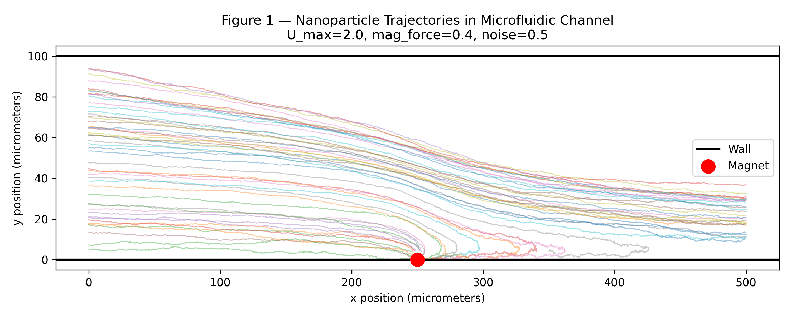
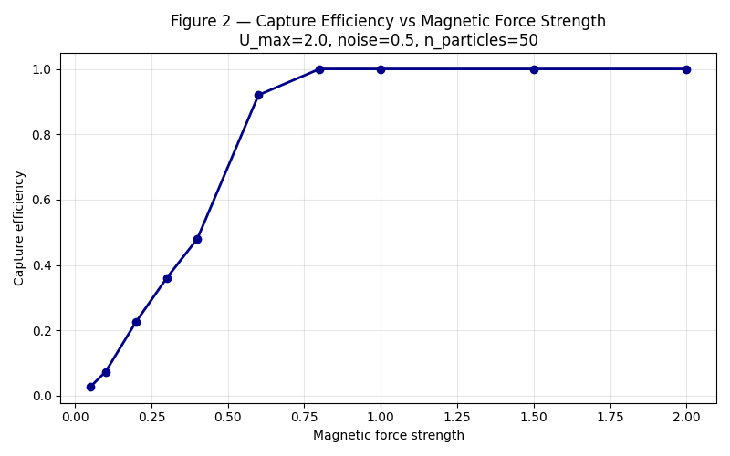
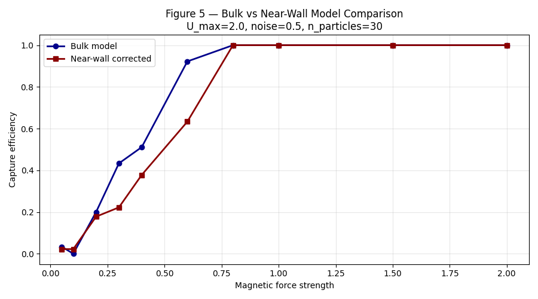

# Magnetic Nanoparticle Capture Simulation

## Overview
This project presents a physics-based 2D Langevin dynamics simulation of magnetic nanoparticle transport in a microfluidic channel for targeted drug delivery.

It compares bulk and near-wall hydrodynamic models and evaluates capture efficiency under varying flow and magnetic conditions.

---

## Results

## Results

### Particle Trajectories
Particles initially follow the flow direction and gradually deviate toward the magnetic source due to applied magnetic force.

---

### Capture Efficiency vs Magnetic Force
Capture efficiency increases with increasing magnetic force, as particles are more strongly attracted toward the capture region.

---

### Capture Efficiency vs Flow Velocity
Higher flow velocities reduce capture efficiency due to increased hydrodynamic drag.

---

### Capture Efficiency Heatmap
Optimal capture occurs at high magnetic force and low flow velocity, as shown in the parameter heatmap.

---

### Bulk vs Near-Wall Comparison
The near-wall model shows more realistic particle behavior due to increased drag and reduced diffusion near boundaries.

---

### ML Prediction
The machine learning model approximates simulation results, showing a strong correlation with computed capture efficiency.

---

## Key Insights
- Capture efficiency increases with magnetic force  
- Capture efficiency decreases with flow velocity  
- Near-wall effects significantly influence particle transport  
- ML model approximates simulation behavior  

---

## Author
Sparsha Adhikari  
Mechanical Engineering
