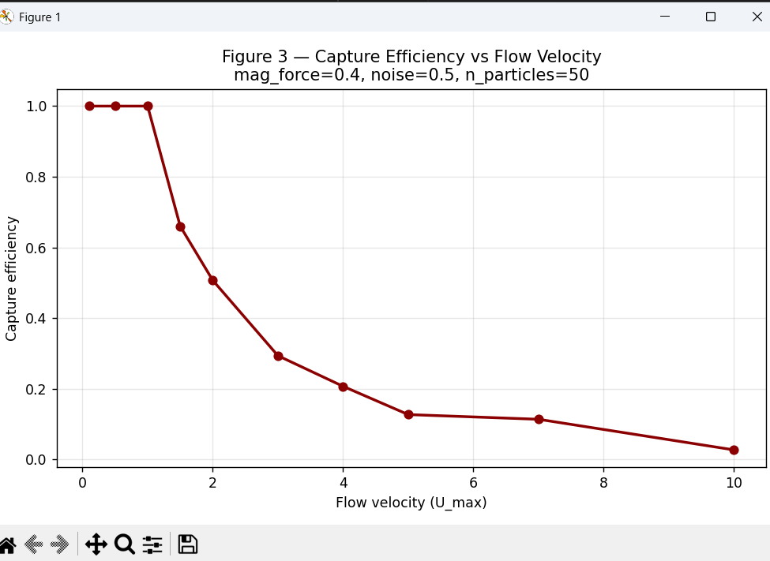
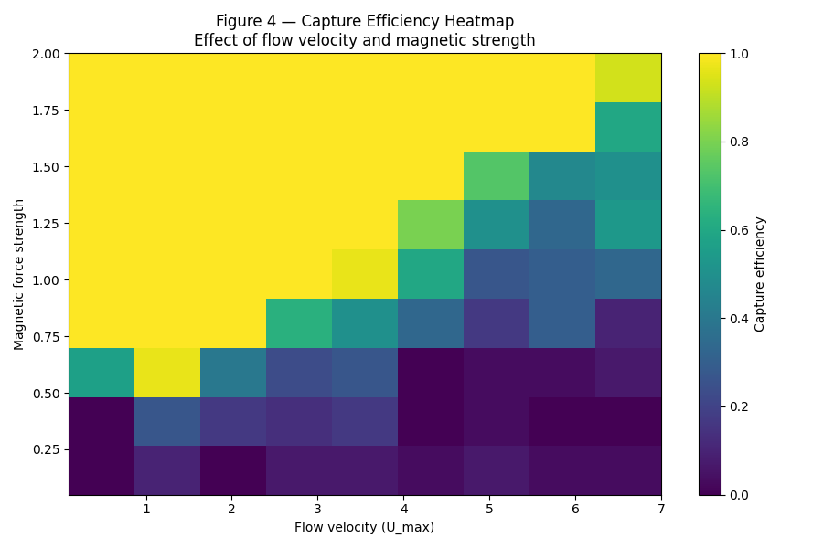
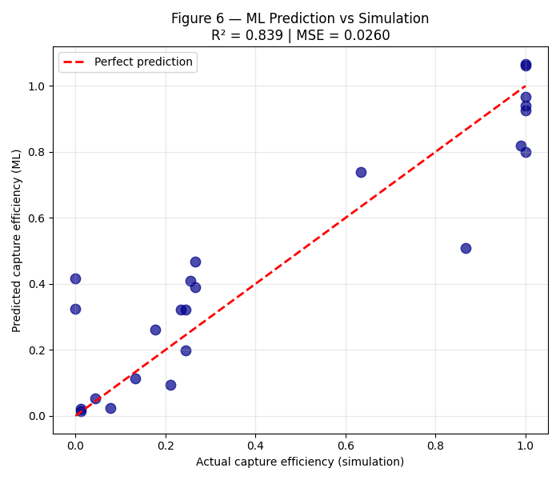

# Magnetic Nanoparticle Capture Simulation

## Overview
This project presents a physics-based 2D Langevin dynamics simulation of magnetic nanoparticle transport in a microfluidic channel for targeted drug delivery.

It compares bulk and near-wall hydrodynamic models and evaluates capture efficiency under varying flow and magnetic conditions.

---
## Results

### Particle Trajectories

### Capture Efficiency vs Magnetic Force

### Capture Efficiency vs Flow Velocity

### Capture Efficiency Heatmap

### Bulk vs Near-Wall Comparison

### ML Prediction

---

## Key Insights
- Capture efficiency increases with magnetic force  
- Capture efficiency decreases with flow velocity  
- Near-wall effects significantly influence particle transport  
- ML model approximates simulation behavior  

---

## Author
Sparsha Adhikari  
Mechanical Engineering
